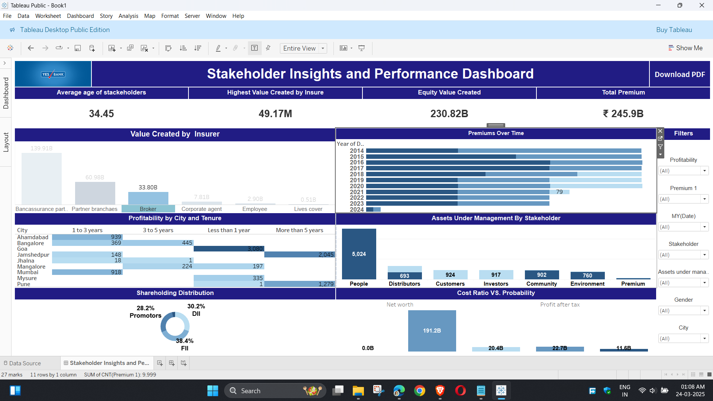

# Tableau_DataAnalytics
"This repository contains a Tableau Banking Data Analytics project, including dashboards, KPIs, and interactive insights for stakeholders. It includes data files, a user guide, and the Tableau workbook."
# 📊 Tableau Data Analytics Dashboard  

  

## 📌 Project Overview  
The **Tableau Data Analytics Dashboard** provides interactive insights into **financial records and stakeholder performance**. This project enables businesses to make **data-driven decisions**, improve financial strategies, and monitor key performance indicators (KPIs) effectively.  

---

## 📂 Repository Contents  
| File | Description |
|------|------------|
| 📂 **Book1.twb** | Tableau workbook file containing the dashboard |
| 📄 **Finance record.xlsx** | Raw financial dataset used in analysis |
| 📊 **Stakeholder Insights Dashboard** | Interactive visual analytics |
| 📖 **User Guide.docx** | Step-by-step instructions for using the dashboard |
| 🖼️ **TableauDataAnalyticsdeshbordimage.png** | Dashboard preview image |
| 🎨 **temaparylogo.jpeg** | Temporary project logo |
| 📜 **LICENSE** | Licensing details |
| 📘 **README.md** | This document |

---

## 🎯 Key Features  
🔹 **Comprehensive Financial Analysis** – Gain insights into financial trends and key metrics.  
🔹 **KPI Tracking** – Monitor performance indicators in real time.  
🔹 **Interactive Filters** – Drill down into specific data segments for better understanding.  
🔹 **Data Visualization** – Clear and engaging graphical representations of financial records.  
🔹 **Export & Share Options** – Easily export reports for business presentations.  

---

## 🛠 Installation & Setup  

### Prerequisites  
Ensure you have the following installed on your system:  
✔ **Tableau Desktop** (or Tableau Public for free access)  
✔ **Microsoft Excel** (to view and modify datasets)  

### Steps to Use the Dashboard  
1️⃣ **Download the Repository**: Click on **Code → Download ZIP** or use Git:  
   ```sh
   git clone https://github.com/Abhishek-Maheshwari-778//Tableau_DataAnalytics.git
   cd Tableau_DataAnalytics
